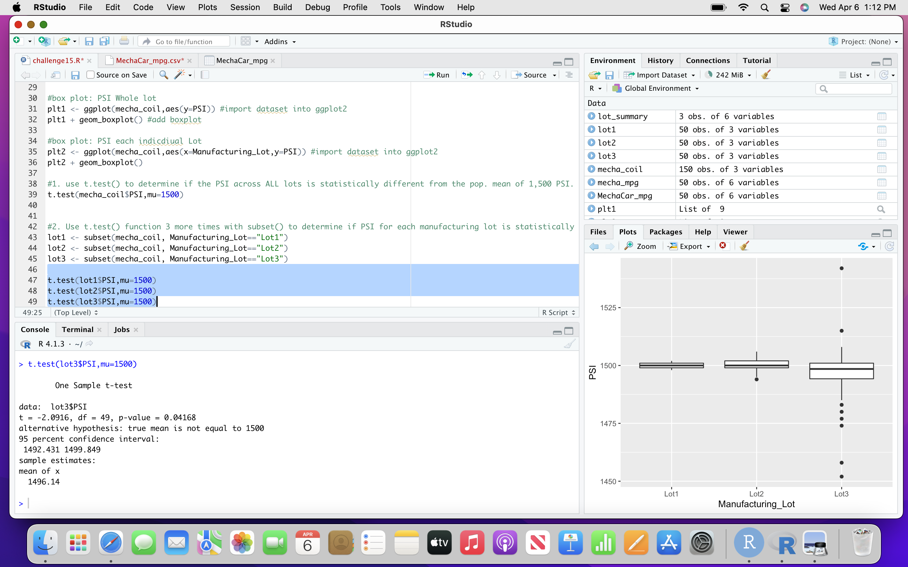
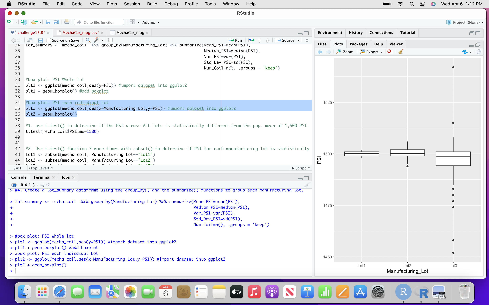
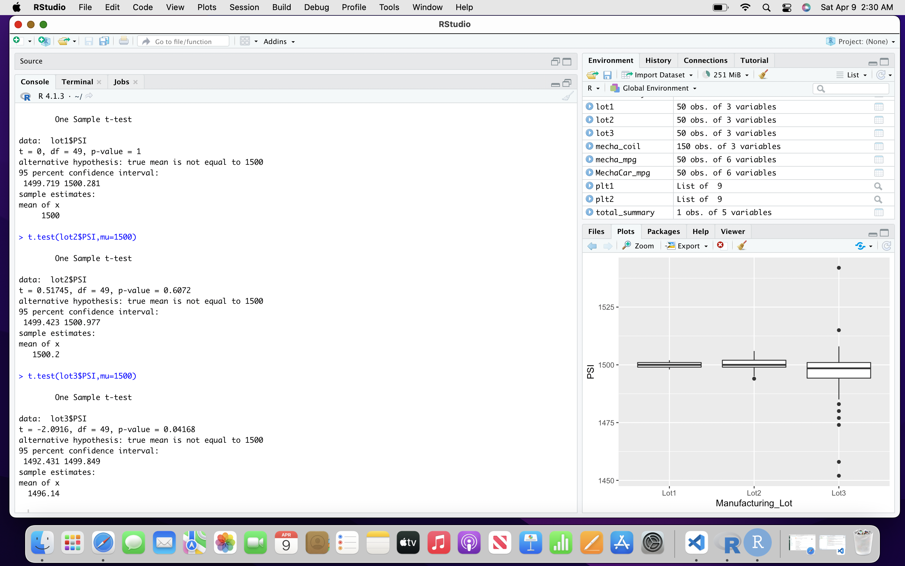

# MechaCar_Statistical_Analysis
Delievarable #1 ##Linear Regression to Predict MPG
mpg = 6.2 vehicle lenngth + 0.0012 weight, + 0.069 spoiler agnel + 3.565 gground + (-3.42 awd) + -104

The p value is is 5.35 e-11 which indicates that there is suffiecent evidence to reject our null hypotheses The slope of the linear model is not zero
The linear models does predict mpg of mechacar whihc as an r-sqared value of .7149 whcih means 71% is determined.

Delievarable #2 ##Summary Statistics on Suspension coils

When examining the peopulations the variance of the coils is 62 PSO which is within 100psi. However, lot 3 has a much larger vairance of 170, the box plot below shows this.

Delievarable #3
## T-test on supspension coils

The mean sample is1496 with a highter p value there is not enough eveidence to support rejecting the null hypothesis. therefore all lots are simialr to the poplulation mean of 1500. By doing this, it shows for system fails and which are not meeting quality criteria.

Delievarable #4
##Study Design: MechaCar vs Competition:

In a compeitive market, MechaCar must examine how it will add value and convience to its vehicle. Compare its modes across its compeition by examining selling price, the models that will be most used to compete against others as well as add effiency to its product.

The metric to test is Mechacar carrrying capicity in cubic inches campared to its competitiors. Also example gas effeicency and maintaince cost over several years.
The null hyppothesesi is averages carring capiacity is similar to competitors vehicles and the alternative hypotheses is the carrying capacity staticially below or above the compeition.
The best test to be used is two sample t-test.
We need other compeitotrs vehilces as well as gathering all mechacar prototypes vehicle cubic space.